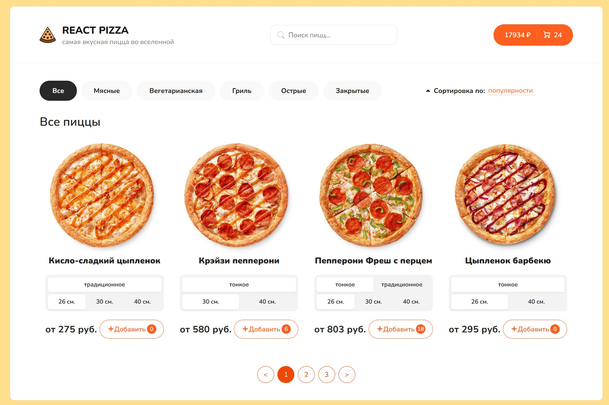

# React pizza

In this project, a pizzeria website was implemented.  
It uses technologies such as: react, js, css, html, typescript, redux toolkit.  
The main page implements sorting, searching, pizza filters, as well as a basket where the user can pay for the order or delete an unnecessary item

  

# How to start:
1. Install node js
1. After in console write npm i
2. After npm start
